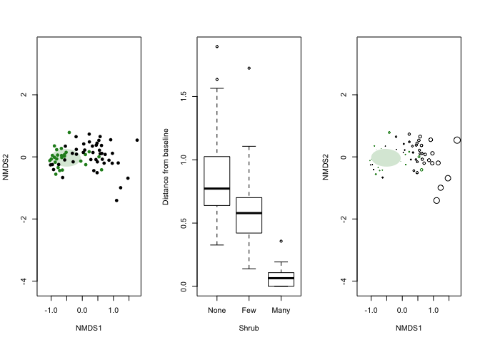

<!-- README.md is generated from README.Rmd. Please edit that file -->

# baselines

<!-- badges: start -->

[](https://zenodo.org/badge/latestdoi/212453101)
<!-- badges: end -->

The goal of baselines is to share code for calculating distance from
baselines in ordination space.

## Installation

You can install this package from github\! First you need to have
`devtools` installed. If not, run `install.packages("devtools")`, before
running the code below.

``` r
# install.packages("devtools")
devtools::install_github("orb16/baselines")
```

## Example

``` r
library(baselines, quietly = TRUE)
#> rgeos version: 0.5-1, (SVN revision 614)
#>  GEOS runtime version: 3.7.2-CAPI-1.11.2 
#>  Linking to sp version: 1.3-1 
#>  Polygon checking: TRUE
#> This is vegan 2.5-6
library(vegan, quietly = TRUE)

data("mite")
data("mite.env")
met <- vegan::metaMDS(mite, "jaccard")
dlist <- calcMyDists(metadf = mite.env, ord = met, group = "Topo", reflev = "Hummock")

# what is the output?

class(dlist)
names(dlist)

head(dlist[[1]])

par(mfrow = c(1, 3))
plot(met, type = "n")
plot(dlist[["baseline_polygon"]], add = TRUE,
     col = adjustcolor("forestgreen", 0.2),
     border = NA)
points(dlist[["all_points"]][dlist[["all_points"]]$Topo == "Hummock", ], col = "forestgreen",
       pch = 16)
points(dlist[["all_points"]][dlist[["all_points"]]$Topo == "Blanket", ], col = "black",
       pch = 16)
with(dlist[["distDF"]][dlist[["distDF"]]$Topo == "Blanket", ], plot(x = Shrub, y = distEllipse, xlab = "Shrub",
                                                                    ylab = "Distance from baseline"))
plot(met, type = "n")
plot(dlist[["baseline_polygon"]], add = TRUE,
     col = adjustcolor("forestgreen", 0.2),
     border = NA)
with(dlist[["distDF"]][dlist[["distDF"]]$Topo == "Hummock", ],
     points(x = NMDS1, y = NMDS2, cex = distEllipse, col = "forestgreen"))
with(dlist[["distDF"]][dlist[["distDF"]]$Topo == "Blanket", ],
     points(x = NMDS1, y = NMDS2, cex = distEllipse, col = "black"))
```


