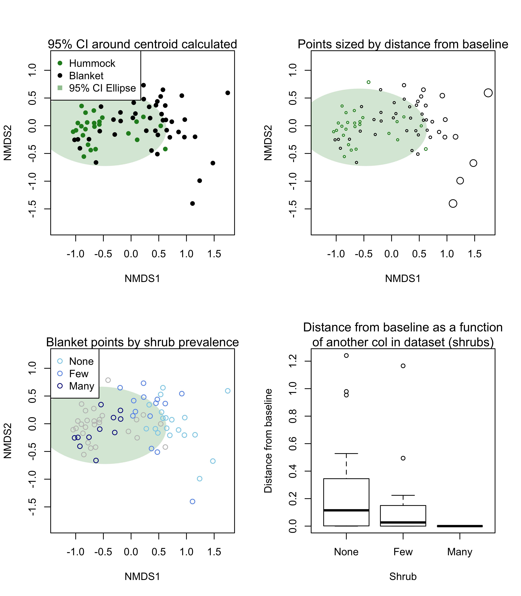

<!-- README.md is generated from README.Rmd. Please edit that file -->

# baselines

<!-- badges: start -->

<!-- badges: end -->

The goal of baselines is to share code for calculating distance from
baselines in ordination space.

## Installation

You can install this package from github\! First you need to have
`devtools` installed. If not, run `install.packages("devtools")`, before
running the code below.

``` r
# install.packages("devtools")
devtools::install_github("orb16/baselines")
```

## Example

This is a basic example which shows you how to solve a common problem:

``` r
library(baselines)
#> Loading required package: sp
#> Loading required package: rgeos
#> rgeos version: 0.5-1, (SVN revision 614)
#>  GEOS runtime version: 3.7.2-CAPI-1.11.2 
#>  Linking to sp version: 1.3-1 
#>  Polygon checking: TRUE
#> Loading required package: vegan
#> Loading required package: permute
#> Loading required package: lattice
#> This is vegan 2.5-6
library(vegan)

data("mite")
data("mite.env")
met <- vegan::metaMDS(mite, "jaccard")
#> Square root transformation
#> Wisconsin double standardization
#> Run 0 stress 0.1491357 
#> Run 1 stress 0.1549725 
#> Run 2 stress 0.1569803 
#> Run 3 stress 0.1693774 
#> Run 4 stress 0.1491369 
#> ... Procrustes: rmse 0.0001202764  max resid 0.0007941942 
#> ... Similar to previous best
#> Run 5 stress 0.1633283 
#> Run 6 stress 0.1562215 
#> Run 7 stress 0.1607044 
#> Run 8 stress 0.1514894 
#> Run 9 stress 0.1565533 
#> Run 10 stress 0.1616589 
#> Run 11 stress 0.1652001 
#> Run 12 stress 0.157918 
#> Run 13 stress 0.1676712 
#> Run 14 stress 0.152441 
#> Run 15 stress 0.1670104 
#> Run 16 stress 0.167452 
#> Run 17 stress 0.1640763 
#> Run 18 stress 0.1524409 
#> Run 19 stress 0.1520637 
#> Run 20 stress 0.1567038 
#> *** Solution reached
dlist <- calcMyDists(metadf = mite.env, ord = met, group = "Topo", reflev = "Hummock")

# what is the output?

class(dlist)
#> [1] "list"
names(dlist)
#> [1] "distDF"           "baseline_polygon" "all_points"

head(dlist[[1]])
#>   SubsDens WatrCont Substrate Shrub    Topo      NMDS1       NMDS2
#> 1    39.18   350.15   Sphagn1   Few Hummock -0.7263673 -0.44144971
#> 2    54.99   434.81    Litter   Few Hummock -0.8507235 -0.55819568
#> 3    46.07   371.72 Interface   Few Hummock -0.7756121 -0.34368387
#> 4    48.19   360.50   Sphagn1   Few Hummock -0.6391734 -0.42411273
#> 5    23.55   204.13   Sphagn1   Few Hummock -0.9975693 -0.07209545
#> 6    57.32   311.55   Sphagn1   Few Hummock -0.8688686 -0.17202149
#>   distEllipse disCentroid centroidNMDS1 centroidNMDS2
#> 1 0.154174390   0.4592214    -0.5241153   -0.02916528
#> 2 0.301585079   0.6217283    -0.5241153   -0.02916528
#> 3 0.074319672   0.4027066    -0.5241153   -0.02916528
#> 4 0.120196404   0.4113658    -0.5241153   -0.02916528
#> 5 0.007071909   0.4753963    -0.5241153   -0.02916528
#> 6 0.000000000   0.3731792    -0.5241153   -0.02916528

par(mfrow = c(1, 3))
plot(met, type = "n")
plot(dlist[["baseline_polygon"]], add = TRUE,
     col = adjustcolor("forestgreen", 0.2),
     border = NA)
points(dlist[["all_points"]][dlist[["all_points"]]$Topo == "Hummock", ], col = "forestgreen",
       pch = 16)
points(dlist[["all_points"]][dlist[["all_points"]]$Topo == "Blanket", ], col = "black",
       pch = 16)
with(dlist[["distDF"]][dlist[["distDF"]]$Topo == "Blanket", ], plot(x = Shrub, y = distEllipse, xlab = "Shrub",
                                                                    ylab = "Distance from baseline"))
plot(met, type = "n")
plot(dlist[["baseline_polygon"]], add = TRUE,
     col = adjustcolor("forestgreen", 0.2),
     border = NA)
with(dlist[["distDF"]][dlist[["distDF"]]$Topo == "Hummock", ],
     points(x = NMDS1, y = NMDS2, cex = distEllipse, col = "forestgreen"))
with(dlist[["distDF"]][dlist[["distDF"]]$Topo == "Blanket", ],
     points(x = NMDS1, y = NMDS2, cex = distEllipse, col = "black"))
```


